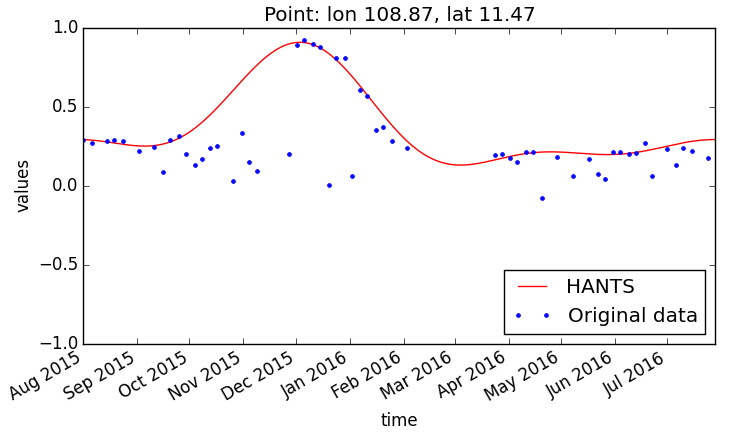

# Harmonic ANalysis of Time Series (HANTS)

This repository is a python implementation of the Harmonic ANalysis of Time Series (HANTS) applied to geospatial data. The python module can be used to perform the HANTS algorithm to a collection of time-variable raster data at each pixel.

The main purpose of this python implementation of HANTS is to fill the gaps in the time series, such as those caused by clouds. Figure 1 shows an example of the Proba-V time series of NDVI in Vietnam from August 2015 to July 2016. The original time series (blue) is fitted by the HANTS algorithm (red) and values well below the curve (e.g. values close to zero in October 2015) can be identified as outliers and replaced by the HANTS.

 
 
 <a name="Figure1"></a>_Figure 1: NDVI values from the Proba-V mission (blue) and HANTS curve values (red) for a point in South-East Vietnam (longitude: 108.87, latitude 11.47) between August 2015 and July 2016. The original Proba-V values that are located well below the HANTS curve can be identified as outliers (e.g. October - December 2015) and an estimate of NDVI for those dates can be obtained from the HANTS curve._


## How to use the code

### Before you start

There are two software options to run HANTS on python:
- [gdal](https://pypi.python.org/pypi/GDAL)
- [arcpy](http://desktop.arcgis.com/en/arcmap/latest/analyze/arcpy/what-is-arcpy-.htm)

The two options are equivalent, the only difference is about the underlying library to process the geospatial data.

### Requirements
- Python 2.7, preferably the [Anaconda](https://www.continuum.io/downloads) 64-bit distribution
- Python libraries:
    - netCDF4 ([https://pypi.python.org/pypi/netCDF4](https://pypi.python.org/pypi/netCDF4))
    - pandas ([https://pypi.python.org/pypi/pandas](https://pypi.python.org/pypi/pandas))
    - matplotlib ([https://pypi.python.org/pypi/matplotlib](https://pypi.python.org/pypi/matplotlib))
- Additional:
    - *gdal* option
        - Python GDAL package ([https://pypi.python.org/pypi/GDAL](https://pypi.python.org/pypi/GDAL))
    - *arcpy* option
        - ArcMap software ([http://desktop.arcgis.com/en/arcmap/](http://desktop.arcgis.com/en/arcmap/))

### Installation

1. Identify a folder in your computer that is recognized by python (e.g. *...\Lib\site-packages*). You can check which folders are recognized by python with the following commands:
    ```python
    >>> import sys
    >>> sys.path
    ['',
    'C:\\Program Files\\Anaconda2\\lib\\site-packages',
    ...
    ```
1. Download or clone the *hants* module from the [online repository](https://github.com/gespinoza/hants) and place it into the folder recognized by python. 
    - Download: https://github.com/gespinoza/hants/archive/master.zip
    - Clone: https://github.com/gespinoza/hants.git
1. Check that *hants* works and that all the required modules are installed.
    - gdal
        ```python
        >>> from hants import wa_gdal
        >>> wa_gdal.__all__
        ['run_HANTS',
         'create_netcdf',
         'HANTS_netcdf',
         'HANTS',
         'export_tiffs',
         'HANTS_singlepoint',
         'plot_point']
        ```
    - arcpy
        ```python
        >>> from hants import wa_arcpy
        >>> wa_gdal.__all__
        ['run_HANTS',
         'create_netcdf',
         'HANTS_netcdf',
         'HANTS',
         'export_tiffs',
         'HANTS_singlepoint',
         'plot_point']
        ```
    **Note:** If you get the following error:
    ```python
    ImportError: No module named ...
    ```
    install the required modules, restart the python console, and repeat this step.

### Examples

#### <a name="gdal_example"></a>Example 1 - Run everything together

```python
from hants.wa_gdal import *  # from hants.wa_arcpy import *

# Data parameters
rasters_path = r'C:\example\data'
name_format = 'PROBAV_S1_TOC_{0}_100M_V001.tif'
start_date = '2015-08-01'
end_date = '2016-07-28'
latlim = [11.4505, 11.4753]
lonlim = [108.8605, 108.8902]
cellsize = 0.00099162627
nc_path = r'C:\example\ndvi_probav.nc'
rasters_path_out = r'C:\example\output_rasters'

# HANTS parameters
nb = 365
nf = 3
low = -1
high = 1
HiLo = 'Lo'
fet = 0.05
delta = 0.1
dod = 1

# Run
run_HANTS(rasters_path, name_format,
          start_date, end_date, latlim, lonlim, cellsize, nc_path,
          nb, nf, HiLo, low, high, fet, dod, delta,
          4326, -9999.0, rasters_path_out)

# Check fit
point = [108.87, 11.47]
ylim = [-1, 1]
plot_point(nc_path, point, ylim)
```

#### <a name="gdal_example"></a>Example 2 - Run processes separately

```python
from hants.wa_arcpy import *  # from hants.wa_gdal import *

# Create netcdf file
rasters_path = r'C:\example\data'
name_format = 'PROBAV_S1_TOC_{0}_100M_V001.tif'
start_date = '2015-08-01'
end_date = '2016-07-28'
latlim = [11.4505, 11.4753]
lonlim = [108.8605, 108.8902]
cellsize = 0.00099162627
nc_path = r'C:\example\ndvi_probav.nc'
create_netcdf(rasters_path, name_format, start_date, end_date,
              latlim, lonlim, cellsize, nc_path)

# Run HANTS for a single point
nb = 365
nf = 3
low = -1
high = 1
HiLo = 'Lo'
fet = 0.05
delta = 0.1
dod = 1

point = [108.87, 11.47]
df = HANTS_singlepoint(nc_path, point, nb, nf, HiLo, low, high, fet,
                       dod, delta)
print df

# Run HANTS
HANTS_netcdf(nc_path, nb, nf, HiLo, low, high, fet, dod, delta)

# Check fit
ylim = [-1, 1]
plot_point(nc_path, point, ylim)

# Export rasters
rasters_path_out = r'C:\example\output_rasters'
export_tiffs(rasters_path_out, nc_path, name_format)
```
## Citation
> Espinoza-Dávalos, G. E., Bastiaanssen, W. G. M., Bett, B., & Cai, X. (2017). *A Python Implementation of the Harmonic ANalysis of Time Series (HANTS) Algorithm for Geospatial Data.* http://doi.org/10.5281/zenodo.820623

## Contact

**Gonzalo E. Espinoza, PhD, MSc**  
Integrated Water Systems and Governance  
IHE Delft Institute for Water Education  
T: [+31 15 2152313](tel:+31152152313)  
E: [g.espinoza@un-ihe.org](mailto:g.espinoza@un-ihe.org)  
I: [un-ihe.org](http://un-ihe.org) | [wateraccounting.org](http://wateraccounting.org) | [gespinoza.org](http://gespinoza.org)  

